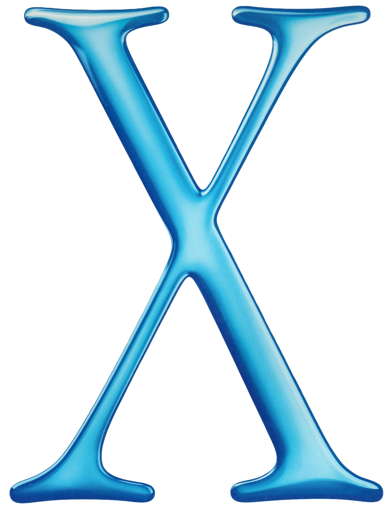

**About This User**

             

# Mac OS X
(Build 16.4.20)

Silliness: 100%
Memory: 2024MB
Processor: Human H10

™ & © My Mom. 1986-2026

# Credits

**Main Site**
* Thom (For the [original website](https://scratch.mit.edu/users/ididntcreateWiiU/).)
* Claude (For helping with the original version.) 

(Almost if not all code is edited and written by me. Claude was used to flatten out an idea and also a mobile bug.)

* Google Gemini (For the Menu Bar.)

(I **KNOW** but am stupid :P)

* DSiMart/WiiMart (For their DSi pic.)
* Apple (For Mac OS X 10.0 - 10.6)

**Assets**
* Mac OS X 10.0 Aqua Buttons: [Original URL](https://codepen.io/andrewmillen/pen/RwqBMrO).
* Apple (For the OSX icons.)
* Goldmario82 (For the iOS 6 [Discord icon](https://www.deviantart.com/goldmario82/art/Discord-icon-ios-6-986597036).)
* TikTok (For their icon.)
* Pretendo (For their icon.)
* Sony (For their PlayStation icon.)
* Microsoft (For their Xbox 360 icon.)
* Twitter (For their icon.)
* Roblox (For their old icon.)
* Google (For their old YouTube icon.)
* X (For their old Twitter icon.)
